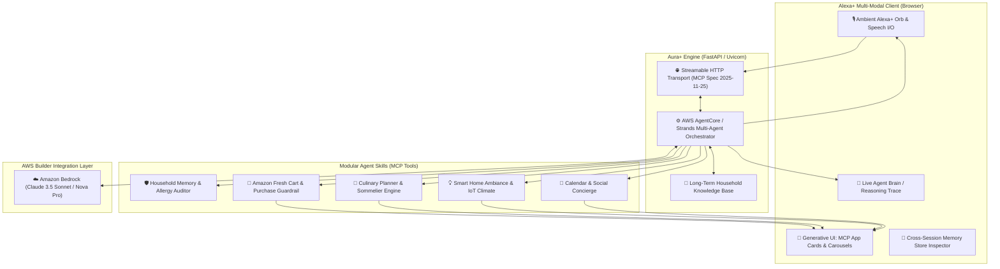

# 🌟 Aura+ : Autonomous Ambient Concierge for Alexa+ & AWS Bedrock

[](https://opensource.org/licenses/MIT)
[](https://modelcontextprotocol.io/)
[](https://aws.amazon.com/bedrock/)
[]()
[]()

> **Submission for the Amazon Developer Hackathon (Build, Ship, Shape 2026)**  
> **Primary Track:** Alexa+ ($25,000 1st Place)  
> **Mini Challenge:** AWS Builder ($5,000 1st Place)  
> **Target Prize:** **$30,000 Cash + $20,000 AWS Promotional Credits**  
> **Bonus Eligible:** 5 Technical Friction Log Entries submitted for the **up to 10% judging bonus**.

---

## 📖 Overview

Traditional voice assistants are **reactive and single-turn**: they answer isolated trivia questions, set timers, or add items to an unorganized list. In contrast, real life requires **proactive, autonomous, multi-service orchestration**.

When a user says:
> *"My parents are visiting this Friday evening for dinner and staying the weekend. Prepare the house, plan a vegetarian Italian dinner with wine pairings, check dietary restrictions from past notes, order missing groceries via Amazon Cart, set the thermostat and ambient lighting schedule, and block my calendar for Saturday morning family brunch."*

A single-turn Q&A bot fails completely. **Aura+** solves this by uniting:
1. **Self-Hosted Model Context Protocol (MCP) Server** (conforming to the **2025-11-25** specification over **Streamable HTTP**).
2. **AWS Bedrock & AgentCore / Strands Multi-Agent Architecture** to decompose high-level goals into parallel tool execution DAGs.
3. **Cross-Session Long-Term Household Memory** that remembers Mom's strict shellfish allergy & gluten sensitivity, Dad's favorite Tuscan Chianti, and room climate preferences.
4. **Interactive Generative UI (MCP Apps)**: Emits interactive multi-course **Recipe Carousels**, an itemized **Amazon Fresh Checkout Card** with a Human-in-the-Loop 1-click purchase approval guardrail, and real-time **IoT Ambiance Sliders**.
5. **High-Fidelity Alexa+ Simulated Web Experience**: Powered by Web Speech voice recognition, ambient glowing voice orb, and real-time streaming "Agent Brain" execution trace.

---

## 🏆 Alignment with Judges' Criteria ("Creative" vs "Obvious")

The hackathon rules explicitly distinguish between *"obvious"* projects (penalized) and *"creative"* projects (rewarded):

| Criteria | Obvious Project (Penalized) | **Aura+ Solution (High Score)** |
| :--- | :--- | :--- |
| **Tech Implementation (25%)** | Basic MCP wrapper around a single API | **Spec-compliant MCP 2025-11-25 server** over **Streamable HTTP (SSE)** with 5 modular Agent Skills and dual-mode Bedrock runtime. |
| **Design & UX (25%)** | Plain text console or chatbot | **Futuristic Alexa+ Web Experience** with ambient glowing voice orb, voice I/O, live agent reasoning trace, and **MCP Apps (Generative UI cards & carousels)**. |
| **Potential Impact (25%)** | Toy demo with no audience | **Universal Alexa+ Household Concierge**: Bridges kitchen Echo Hubs, living room Fire TV, Ring front doors, and Amazon Fresh commerce. |
| **Quality of Idea (25%)** | Single-turn Q&A bot | **Autonomous Multi-Agent Orchestration**: Cross-session memory, multi-step goal execution, financial guardrails, and state persistence. |
| **AWS Builder Mini Challenge** | Single Bedrock call for text | **Bedrock + AgentCore / Strands Architecture**: Structured Supervisor -> Worker agents hierarchy with Converse API tool calling. |
| **10% Bonus Points** | None provided | **5 Rigorous Friction Log Entries** covering Streamable HTTP, Bedrock Converse, and Agent Skills schemas. |

---

## 🏗️ System Architecture



---

## 🚀 Quick Start (Zero Hardware Required)

Aura+ runs 100% locally on your machine with zero physical hardware dependencies.

### 1. Prerequisites
- Python 3.10+
- Modern Web Browser (Google Chrome recommended for native Web Speech voice input)

### 2. Launch in One Command
```bash
./run.sh
```

Or manually:
```bash
# 1. Activate virtual environment
source .venv/bin/activate

# 2. Run automated test suite
PYTHONPATH=. pytest -v tests/

# 3. Start server
PYTHONPATH=. python3 -m uvicorn main:app --host 0.0.0.0 --port 8000 --reload
```

### 3. Open the Experience
- **Alexa+ Web Simulator:** [http://localhost:8000](http://localhost:8000)
- **MCP Streamable HTTP SSE:** [http://localhost:8000/mcp/sse](http://localhost:8000/mcp/sse)
- **MCP JSON-RPC Endpoint:** [http://localhost:8000/mcp/message](http://localhost:8000/mcp/message)

---

## 🧪 1-Click Judge Showcase Scenarios

When you open [http://localhost:8000](http://localhost:8000), use the **1-Click Showcase Ribbon** at the top of the screen to evaluate complex autonomous workflows instantly:

### 🌟 Showcase 1: "Family Weekend Prep" (Grand Slam)
- **What it triggers:**
  1. Master Planner decomposes the goal into a multi-agent execution DAG.
  2. Queries household memory to discover Mom's strict shellfish allergy and gluten sensitivity.
  3. Plans an authentic 4-course menu (Antipasto, Gluten-Free Penne all'Arrabbiata, Dad's favorite Chianti Classico Riserva, and Decaf Tiramisu) rendered as an interactive **Recipe Carousel MCP App**.
  4. Searches Amazon Fresh inventory, filters certified gluten-free products, and builds an itemized grocery cart totaling **$62.24** rendered as a **Fresh Checkout Card MCP App**.
  5. Schedules the **Tuscan Sunset** ambiance scene for Friday at 6:30 PM (71°F climate, warm amber lighting, acoustic dinner jazz on Amazon Music).
  6. Schedules the family dinner on the calendar with automatic reminder buffers.
- **Interactive Action:** Tap **"Approve & Place Order"** to test the Human-in-the-Loop financial checkout guardrail!

### 🛡️ Showcase 2: "Safety & Allergy Audit"
- Demonstrates cross-session memory retrieval and highlights critical health/dietary guardrails before shopping.

### 🍷 Showcase 3: "Evening Ambiance & Sommelier"
- Configures multi-zone lighting Kelvin, thermostat, and music stream with live interactive sliders.

---

## 📡 MCP Protocol Endpoints (Spec 2025-11-25+)

Aura+ strictly conforms to the Model Context Protocol over Streamable HTTP:

- `GET /mcp/sse`: Connects to Server-Sent Events stream, returns `endpoint` handshake.
- `POST /mcp/message?session_id=...`: Handles JSON-RPC 2.0 requests:
  - `initialize`: Returns protocol version `2025-11-25`, server capabilities, and instructions.
  - `tools/list`: Lists all 5 Agent Skills with typed input schemas.
  - `tools/call`: Executes skills (`household_memory_query_dietary`, `amazon_cart_assemble`, `smart_ambiance_set_scene`, etc.).
  - `resources/list` & `resources/read`: Real-time state of `household://profile`, `amazon://fresh_catalog`, and `smart_home://active_scene`.
  - `prompts/list`: Pre-engineered prompts (`prepare_family_weekend`).

---

## ☁️ AWS Builder Mini-Challenge Integration

- **Amazon Bedrock (`boto3` Runtime)**: Powers the cognitive reasoning engine using the Converse API with structured tool schemas (`BEDROCK_TOOL_SPECS`).
- **AWS AgentCore / Strands SDK Architecture**: Implements a modular orchestrator-worker pattern separating Perception, Planning, Tool Invocation, and Synthesis.
- **Dual-Mode Execution**:
  - Automatically invokes live AWS Bedrock when credentials (`AWS_ACCESS_KEY_ID`, `AWS_SECRET_ACCESS_KEY`) are present.
  - Gracefully falls back to high-fidelity local deterministic simulation if credentials are unset, ensuring zero judge evaluation hiccups.

---

## 📋 Hackathon Deliverables Index

- **Official Rules:** [inputs/rules.md](file:///home/vboxuser/amazon_hackathon/inputs/rules.md)
- **Technical Friction Logs (10% Bonus):** [docs/friction_logs.md](file:///home/vboxuser/amazon_hackathon/docs/friction_logs.md)
- **Product Feedback & AWS Review:** [docs/product_feedback.md](file:///home/vboxuser/amazon_hackathon/docs/product_feedback.md)
- **3-Minute Demo Video Script:** [docs/demo_video_script.md](file:///home/vboxuser/amazon_hackathon/docs/demo_video_script.md)
- **Implementation Plan:** [docs/implementation_plan1.md](file:///home/vboxuser/amazon_hackathon/implementation_plan1.md)

---

## 📄 License

This project is licensed under the **MIT License** — see the [LICENSE](file:///home/vboxuser/amazon_hackathon/LICENSE) file for details.
