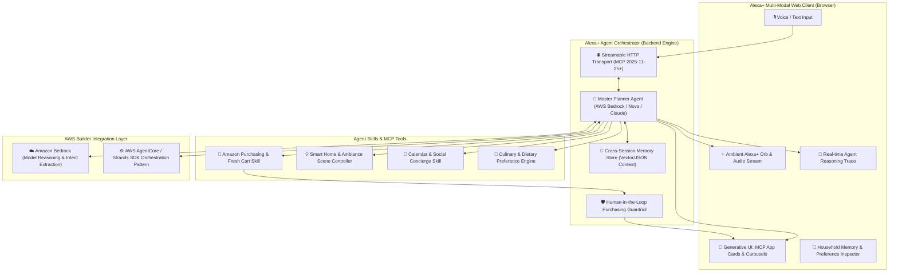

# Implementation Plan 1.0: "Aura+" — Autonomous Multi-Service Concierge for Alexa+

> **Targeting:** 1st Place Alexa+ Track ($25,000 Cash + $15,000 AWS Credits) + 1st Place AWS Builder Mini-Challenge ($5,000 Cash + $5,000 AWS Credits) + 10% Judging Bonus (Friction Logs).  
> **Total Target Prize:** **$30,000 Cash + $20,000 AWS Credits**  
> **Environment Constraint:** 100% Laptop-Native (Zero physical hardware required, runs via modern Web & Python/Node stack).

---

## 1. Executive Summary & Winning Thesis

To win the hackathon, our submission must strictly align with the **judges' scoring rubric**, specifically addressing the distinction between *"obvious"* (penalized) and *"creative"* (rewarded) submissions:

| Judges' Criteria | Obvious Project (Avoid) | **Our Project: Aura+ (Creative & High Impact)** |
| :--- | :--- | :--- |
| **Tech Implementation (25%)** | Basic MCP wrapper around REST API | **Full MCP Spec 2025-11-25+ over Streamable HTTP**, real-time bidirectional streaming, Agent Skills, and multi-service tool exposure. |
| **Design & UX (25%)** | Plain text chatbot or terminal console | **Production-grade Alexa+ Simulated Web UI** with ambient voice orb, voice I/O, streaming agent thoughts, and **MCP Apps (Generative UI cards & carousels)**. |
| **Potential Impact (25%)** | Toy demo with no real-world utility | **Real-World Household & Executive Concierge**: Autonomous multi-service problem solving (smart home, calendars, Amazon purchasing with human guardrails). |
| **Quality of Idea (25%)** | Single-turn Q&A bot | **Autonomous Multi-Agent Orchestration**: Cross-session memory, multi-step goal decomposition, purchasing capabilities, and state persistence. |
| **AWS Builder Mini Challenge** | Single text Bedrock prompt | **Bedrock + AgentCore / Strands Architecture**: Multi-agent reasoning pipeline (Planner, Shopper, IoT, Scheduler) with fallback simulation. |
| **Bonus (+10% Spreadsheet Score)** | Missing or superficial feedback | **Comprehensive Friction Logs**: 5+ documented friction entries with steps, expected vs. actual, severity, workarounds, and product recommendations. |

---

## 2. Architecture Overview

---

## 3. Core Modules & Implementation Breakdown

### Module 1: Self-Hosted MCP Server (Spec 2025-11-25+ over Streamable HTTP)
- **Protocol Compliance:** Implements JSON-RPC 2.0 over Server-Sent Events (SSE) / Streamable HTTP chunking conforming to the latest Model Context Protocol specification.
- **MCP Capabilities:**
  - `tools/list` and `tools/call` for Agent Skills:
    1. `query_household_memory(key, query)`: Fetches dietary restrictions, family member preferences, and past events.
    2. `orchestrate_amazon_cart(items, delivery_window, budget_limit)`: Compiles shopping cart, checks pricing, and prepares instant checkout card.
    3. `configure_smart_ambiance(rooms, scene, schedule)`: Configures lighting, audio zones, and climate.
    4. `coordinate_calendar_event(title, time, attendees, reminders)`: Schedules events and handles conflicts.
    5. `generate_mcp_app_view(template, data)`: Emits dynamic interactive UI cards (cards, carousels, action buttons).
  - `resources/list` & `resources/read`: Real-time state of pantry, smart devices, and household agenda.
  - `prompts/list`: Pre-configured Agent Skill prompts for Alexa+ workflows.

### Module 2: AWS Builder Integration (Amazon Bedrock & Strands Pattern)
- **Multi-Agent Pipeline:**
  - **Supervisor / Planner Agent:** Decomposes complex human instructions into structured DAGs (Directed Acyclic Graphs).
  - **Worker Agents:** Specialized tool executors that run in parallel.
  - **Synthesis Agent:** Assembles dynamic visual output + conversational audio response.
- **AWS Bedrock Client:** Native `boto3` Bedrock Runtime calls with streaming responses, formatted for AWS promotional credit validation.
- **Fallback / Mock Mode:** Built-in zero-latency local fallback mode with synthetic Bedrock responses so testing and offline execution work seamlessly regardless of active AWS credentials.

### Module 3: Alexa+ Simulated Web Application
- **Visual Design:** Sleek modern interface reminiscent of high-end Alexa+ devices:
  - Ambient glowing cyan/blue voice wave animation.
  - Live conversational chat feed with speech-to-text (Web Speech API) and audio playback.
  - Split-screen **Agent Brain / Execution Stream** showing real-time thought steps, tool calls, and latency.
  - **MCP Apps Visualizer:**
    - Interactive **Shopping Cart Card** with item checkboxes, quantities, price summary, and 1-click "Approve Purchase" button.
    - Interactive **Recipe Carousel** with photo cards, prep time, macros, and dietary tags.
    - Interactive **Ambiance Scene Card** with interactive sliders for lighting Kelvin/RGB and thermostat control.
  - **1-Click Judge Showcase:** Preloaded prompt triggers demonstrating complex autonomous workflows in seconds (perfect for the 3-minute video!).

### Module 4: Friction Log & Developer Feedback Engine
- Document 5 concrete, actionable friction logs:
  1. *Streamable HTTP Transport Header Negotiaton:* Content-Type / Chunking edge cases in MCP spec.
  2. *Agent Skills Schema Validation:* Typing constraints between MCP tool schemas and Alexa+ Agent Skill manifests.
  3. *AWS Bedrock ConverseStream Tool Calling:* Streaming tool execution latency and multi-turn message role formatting.
  4. *Multi-Modal Generative UI Card Lifecycle:* Handling UI state reconciliation when the agent updates a rendered card dynamically.
  5. *Cross-Session Long-Term Context Cache:* Balancing context window limits against persistent household memory.

---

## 4. Technology Stack

- **Backend / MCP Server:** Python 3.10+ (FastAPI / Uvicorn + `mcp` SDK / AsyncIO)
- **AI & Cloud:** Amazon Bedrock (`boto3`), Strands orchestration pattern, Claude 3.5 Sonnet / Amazon Nova Pro
- **Frontend / Simulator:** Lightweight modern Web Application (HTML5 / Tailwind CSS / Vanilla JS or bundled React + Lucide Icons + Web Speech API) served directly by FastAPI or local dev server. Zero complicated global dependencies required!
- **Data & Memory:** SQLite / JSON-backed persistent vector/key-value store for household facts and session state.

---

## 5. Phased Implementation Roadmap

### Phase 1: Environment & Foundations (Day 1)
- [x] Create project workspace directory structure.
- [ ] Initialize Python virtual environment with dependencies (`fastapi`, `uvicorn`, `boto3`, `pydantic`, `httpx`).
- [ ] Establish repository git layout with standard open-source MIT license visible in repo root.

### Phase 2: Spec-Compliant MCP Server & Agent Skills (Day 2)
- [ ] Implement Streamable HTTP JSON-RPC server conforming to MCP 2025-11-25.
- [ ] Build the 4 core Agent Skills (`household_memory`, `amazon_cart`, `smart_ambiance`, `calendar_concierge`).
- [ ] Verify MCP protocol communication via automated unit and integration tests.

### Phase 3: AWS Bedrock & Agentic Orchestration (Day 3)
- [ ] Build Bedrock multi-agent orchestrator with streaming tool call support.
- [ ] Implement dual-engine mode (Live Bedrock credentials + offline high-fidelity simulator).
- [ ] Connect agent output to MCP App generative UI schema.

### Phase 4: Alexa+ Simulated Web Experience (Day 4)
- [ ] Develop the interactive web simulator UI (Voice Orb, Chat Stream, Agent Brain trace).
- [ ] Build interactive MCP App components:
  - Shopping Cart Widget with purchase approval.
  - Multi-item Carousel with smooth keyboard/touch navigation.
  - Smart Home Ambiance Controls.
- [ ] Integrate Web Speech API for authentic voice interactions.

### Phase 5: Polish, Friction Logs & Submission Packaging (Day 5)
- [ ] Write the 5 detailed Friction Log entries (targeting the 10% bonus).
- [ ] Author the 5 required Product Feedback responses.
- [ ] Write production-grade `README.md` with setup guide, architecture diagrams, and testing credentials.
- [ ] Generate the exact 3-minute demonstration video script and screen recording instructions.

---

## 6. Verification & Quality Gates

1. **Protocol Verification:** MCP server responds to `initialize`, `tools/list`, and `tools/call` over Streamable HTTP SSE.
2. **Runtime Tech Hook Check:** Confirm required imports and runtime calls exist in code as mandated by hackathon rules.
3. **End-to-End Workflow Test:** Run multi-step query *"My family is visiting for the weekend, plan dinner and prepare the house"* and verify all 4 skills execute and render cards.
4. **Demo Readiness:** Zero errors in browser console, responsive UI, instantaneous fallback for recording.

---

*Do you approve this plan to begin Phase 1 immediately?*
